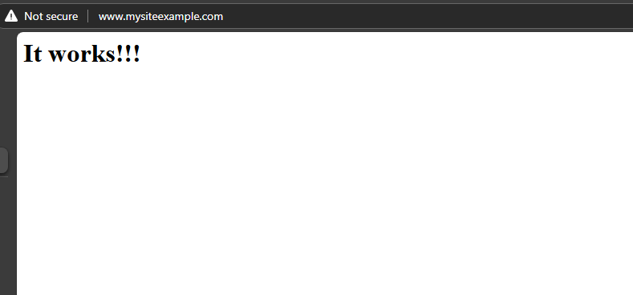

# Ansible Win: Step-by-Step Guide

This guide will walk you through setting up a Windows environment using Vagrant and Ansible. Follow these steps to configure and deploy a website with IIS.

## Prerequisites

- Ensure that Vagrant and VirtualBox are installed on your host machine.

## Steps

1. **Start the Vagrant Environment**
   - Run the following command to start the Vagrant environment:

     ```bash
     vagrant up
     ```

2. **Remote Desktop into Windows**
   - Connect to the Windows VM using RDP with the following command:

     ```bash
     vagrant rdp windows
     ```

   - Use the credentials:
     - Username: `vagrant`
     - Password: `vagrant`

3. **Configure Windows for Ansible Remoting**
   - In the Windows VM, open PowerShell and execute the script to configure remoting for Ansible:

     ```powershell
     powershell /vagrant/ConfigureRemotingForAnsible.ps1
     ```

   - **Note:** This configuration should only be used in development or testing environments.

4. **SSH into the Ubuntu VM**
   - On your host machine, SSH into the Ubuntu VM:

     ```bash
     vagrant ssh ubuntu
     ```

5. **Install Ansible**
   - In the Ubuntu VM, run the script to install Ansible:

     ```bash
     bash /vagrant/install-ansible.sh
     ```

6. **Run the Ansible Playbook**
   - Execute the Ansible playbook to set up IIS:

     ```bash
     ansible-playbook -i /vagrant/ansible/inventory /vagrant/ansible/setup_iis.yml
     ```

7. **Update Host Entries on the Host Machine**
   - On your host machine, open a terminal with administrative privileges and run the following script to add a host entry:

     ```powershell
     .\Add-HostEntry.ps1 -ipAddress "192.168.56.11" -canonicalName "www.mysiteexample.com"
     ```

8. **Access the Deployed Website**
   - Open a web browser on your host machine and navigate to <http://www.mysiteexample.com>

   - You should see the deployed website:
     
